### etos face swap
Swap face between two photos for Python 3 with OpenCV and dlib.


### Get Started
```sh
python main.py --src imgs/test1.jpg --dst imgs/test5.jpg --out results/output1_5.jpg --correct_color
```

| Source | Destination | Result |
| --- | --- | --- |
| | 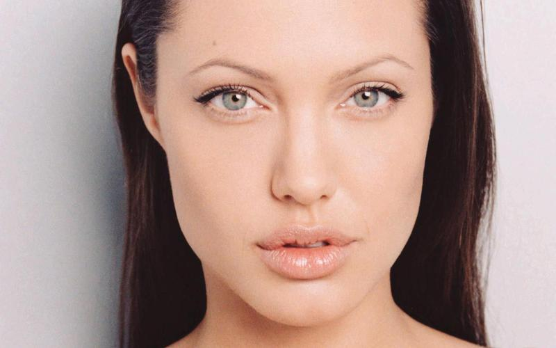 | 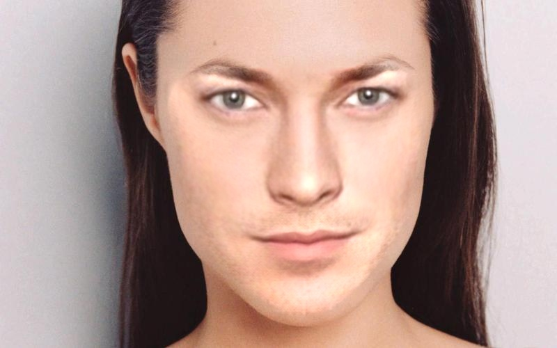 |

```sh
python main.py --src imgs/test1.jpg --dst imgs/test5.jpg --out results/output1_5_2d.jpg --correct_color --warp_2d
```

| Source | Destination | Result |
| --- | --- | --- |
| |  | 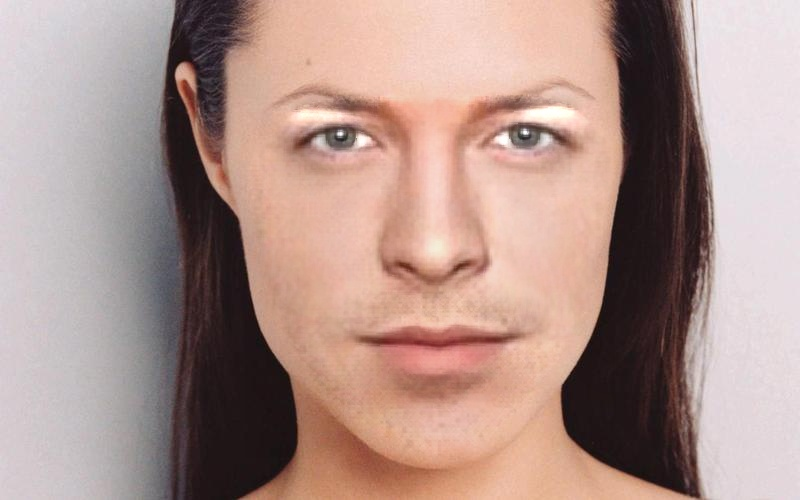 |

### Install
#### Requirements
* [dlib](http://dlib.net/)
* OpenCV 3

Note: See [requirements.txt](requirements.txt) for more details.
```
pip install -r requirements.txt
```
### Git Clone
```sh
git clone https://github.com/etosworld/etos-faceswap
```
### Swap Your Face
```sh
python main.py ...
```
Note: Run **python main.py -h** for more details.

## More Results
| From | To |
| --- | --- |
| 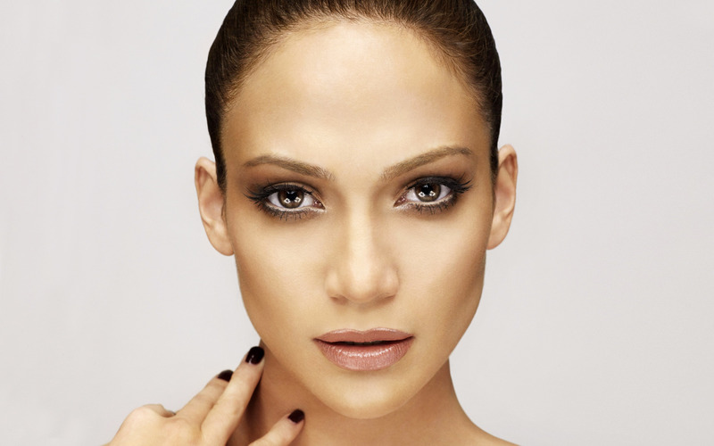 |  |
| 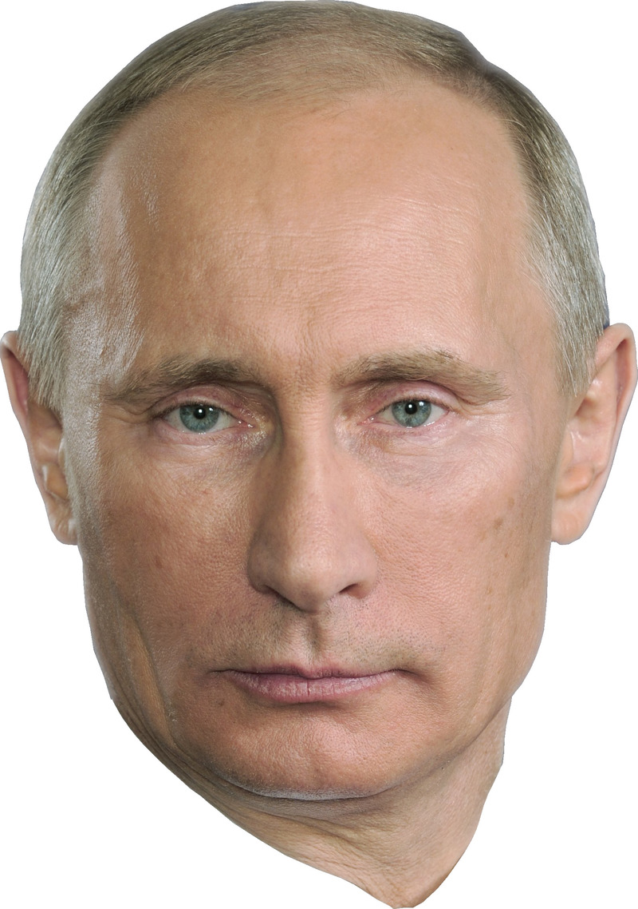 | 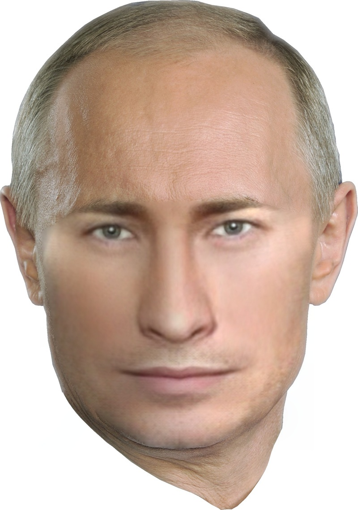 |
| 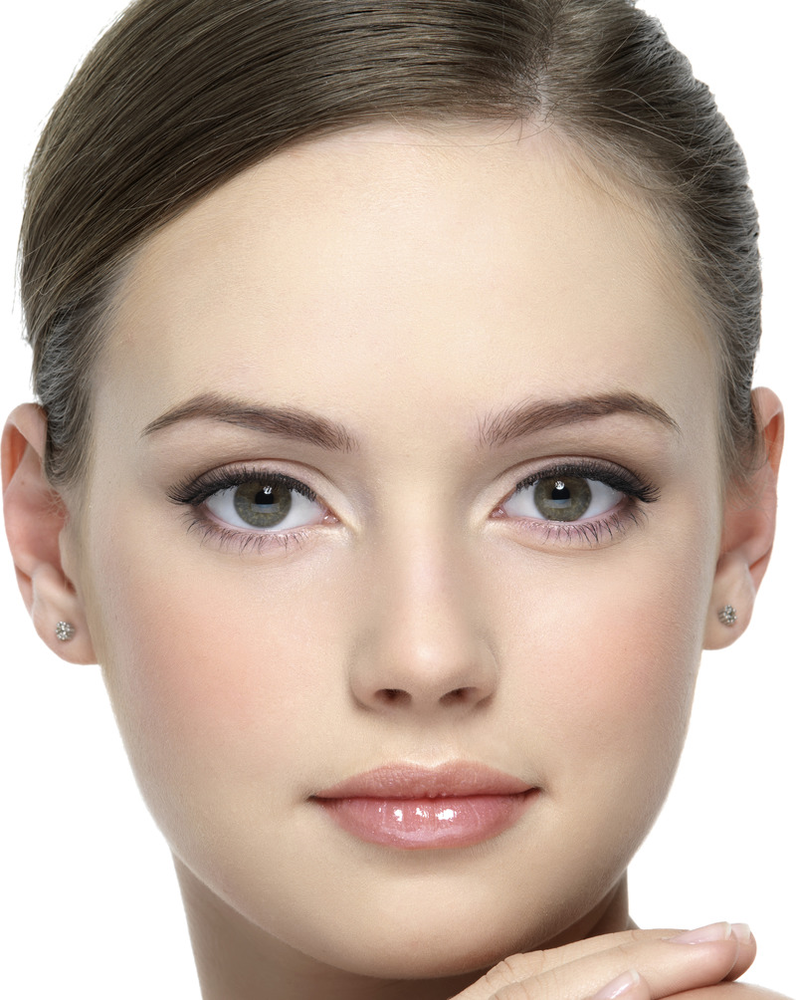 | 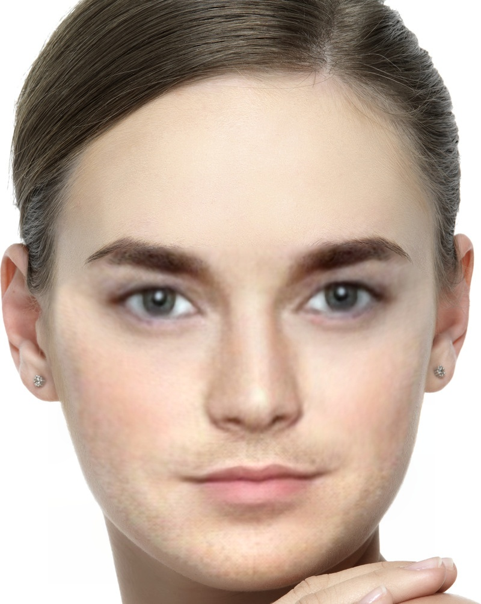 |
| 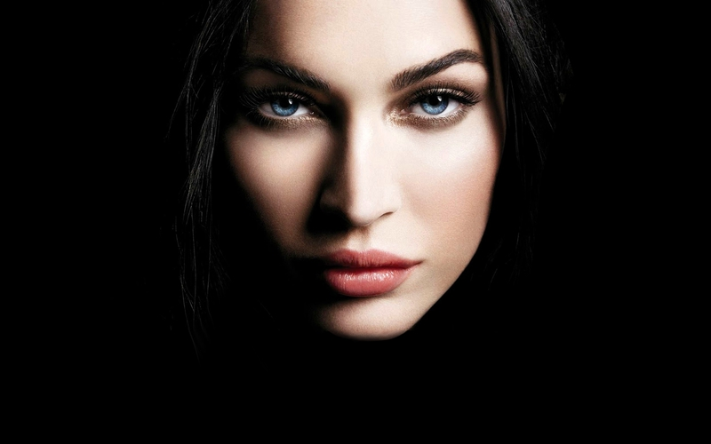 | 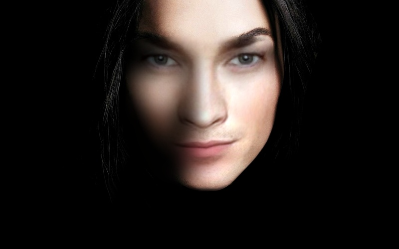 |
| 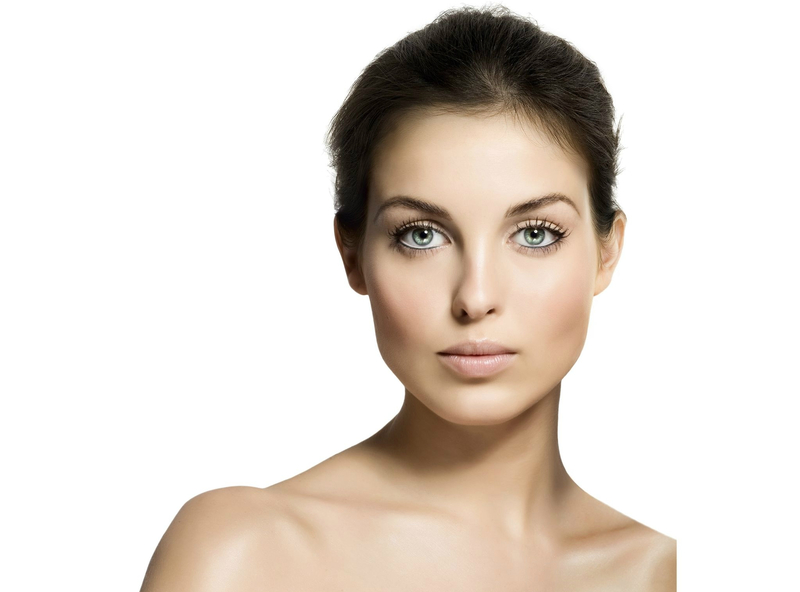 | 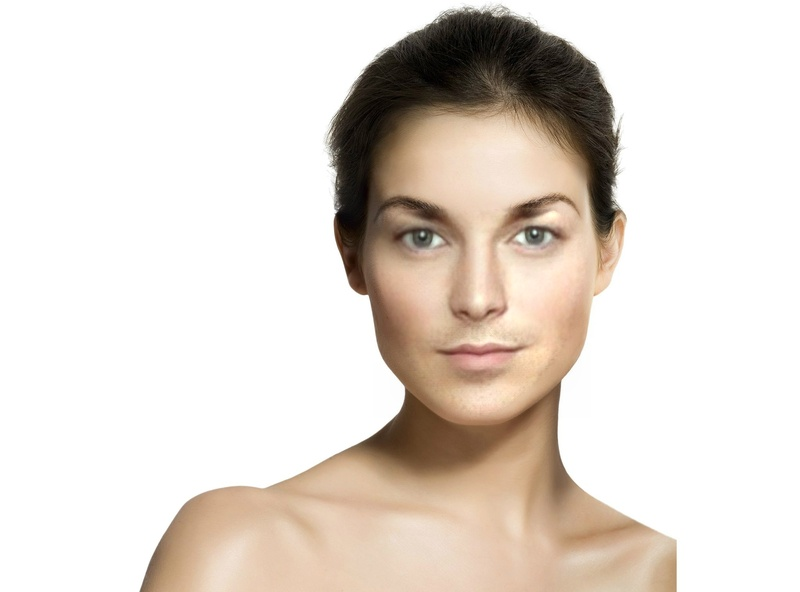 |
